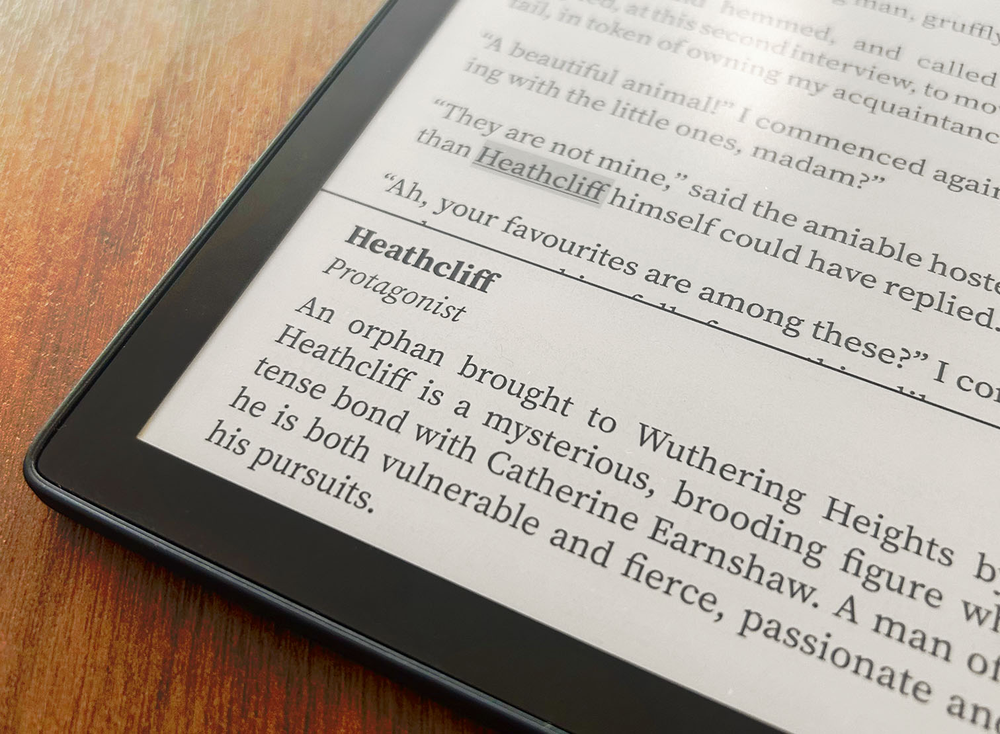
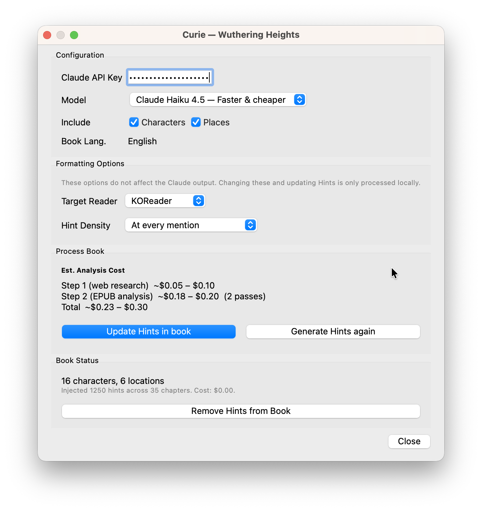

# What is Curie?

Curie is a **Calibre plugin** that generates spoiler-free hints of characters and places and injects these as footnotes into your EPUBs.

*Photo of Wuthering Heights processed and running on KOReader.*

## How it works

First, Curie uses Claude to fetch information about the book's characters and locations from the web. This is then cross-referenced with the EPUB itself to make sure descriptions are correct and at the same time removing spoilers. Due to the nature of AI, this data fetching and processing is non-deterministic. A JSON file is saved in the Calibre's books folder with the results.

The hints themselves (technically footnotes) are then injected into the EPUB. They are injected at the point in the text where the character or location is first mentioned, but only after they have already been described. In other words, the EPUB injection is handled locally and deterministically — meaning Claude never modifies the EPUB directly. This is good, as the injected hints added to the book can then be cleanly removed and modified.

*Screenshot of plugin in Calibre*

## Why Curie?

Reading books and getting immersed in a story is pure magic. Forgetting names and having to backtrack breaks that. This can be especially true when reading books that are not in your native tongue and have character names you can't really "taste". I'm looking at you, Dostoevsky.

## Features

* Summarizes characters and/or locations in books (spoiler free!)

* Catches nicknames of characters and maps them correctly

* Choose density of hints (Every mention, every 10 paragraphs, once per chapter)

* Supports KOReader and Nickel

* Tested with 🇬🇧 English and 🇸🇪 Swedish, but should support any language Claude supports

## API Costs & Processing Time

Using *Claude Haiku*, the average processing cost of an averaged length novel is around 0.30$. That includes both places and characters. Using *Sonnet* is costlier (around 3x), but from my experience Haiku delivers quality summaries without any spoilers. Due to Rate Limits, a longer book will take longer time - expect a time of 1 to 4 minutes. 

## Compatibility

### KOReader

* Enables a richer styling of pop-ups

* To enable these Hints as pop-ups, enable **Show footnotes in popup** in *Settings -> Taps and gestures -> Links*. 

### Nickel (Kobo default)

* Requires **KEPUB** format to be able to display hints as pop-ups

* No formatting (CSS) is allowed in the pop-up, only shows raw text

### Other readers
Untested

## Roadmap
* [ ] Support for other API:s (Qwen, OpenAI, Gemini)
* [ ] Descriptions of character or places gets updated chapter-by-chapter as the story unfolds (how to not make this madly expensive token-wise?)
* [ ] Inspect generated data inside the plugin GUI. Expected behaviour: Click a button inside the plugin GUI to see a visual representation of characters and/or places
* [ ] Add support for hints converting Freedom Units into International System of Units
* [ ] Add map images for actual places, on country or world map (only feasible on KOReader)
* [ ] Ability to mark characters or places as "known" - requires Curie to also be a plugin in KOReader
* [ ] Ability to toggle or highlight the hints upon user interaction (otherwise the hints should be hidden) - requires Curie to be a plugin in KOReader
